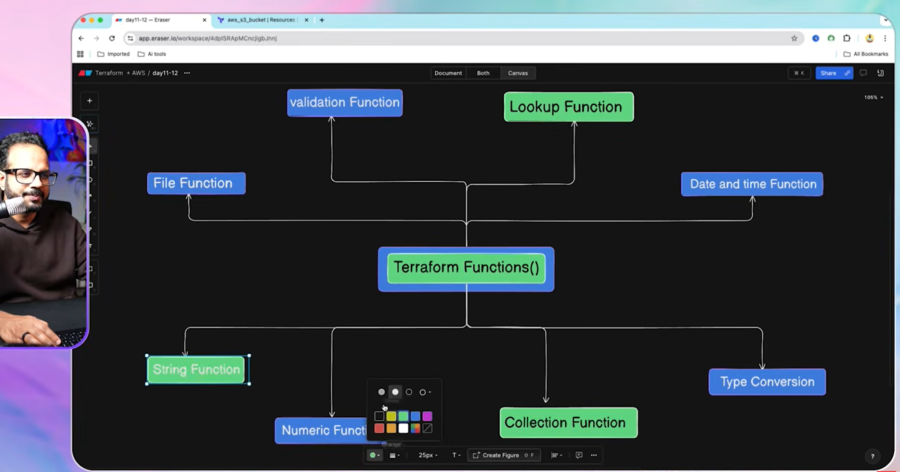

## Functions

No custom function in terraform
Only inbuilt functions

**Collection**
concate()
tolist()
toset()
merge()

**Lookup**
lookup(input,search,default)

**String**
upper()
lower()
substr(input,start,end)
replace(input,replace,replaced by)

**Number**

max()
min()
abs() -> positive
sum()

**String interpolation** "APP-${port}" ->used in for each

**Validation**

endswith()
can(expression)

It returns:

✅ true → if the expression succeeds.
❌ false → if the expression throws an error.

regex()

validation {
    condition = length(var.instance_type) >=2 && length(var.instance_type)<20
    error_message ="length mismatch"
}

validation {
    condition = can(regex("^t[2-3]\\."), var.instance_type)
    error_message ="intsance type mismatch"
}

**Timestamp**

timestamp() -> returns current timestamp in UTC format
formatdate("yyyy-mm-dd",timestamp())

**File Handling**
fileexists("path")
jsondecode(file(path))