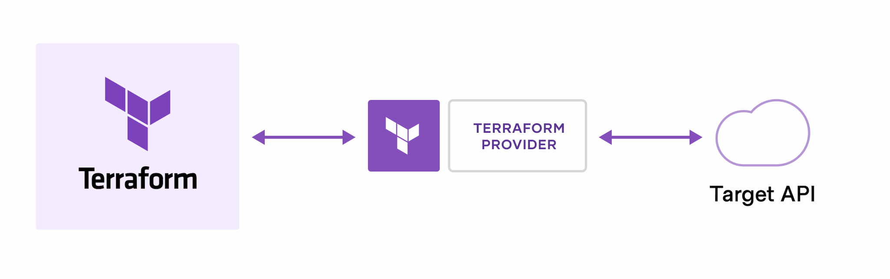

## Terraform Providers

Providers are plugins that allow Terraform to interact with cloud platforms like AWS, GCP, Azure, SaaS services, and other APIs.

Terraform itself can't decide provisioning. Providers understand resources and talk to API and provision resources.

They enable Terraform to call the underlying platform APIs and create, update, or delete resources defined using HCL (HashiCorp Configuration Language).

Each provider has its own version, and Terraform provider versions should be carefully managed and locked, especially during development (DEV) and testing (UAT), to ensure consistency and avoid unexpected changes.



### Why Providers are Needed?

Each provider defines its own set of resource types and data sources. Without providers, Terraform cannot interact with or manage any external system.

Terraform providers can be developed and maintained by HashiCorp (official providers) as well as by third-party or external vendors.

**Official providers (HashiCorp-maintained)**
These are built and maintained by Terraform’s parent company, HashiCorp.
Example: aws, azurerm, google, kubernetes
**Third-party providers (community or vendor-maintained)**
These are created by external companies or the open-source community to support additional services and APIs.
Example: datadog, github, cloudflare, etc.
**Utility providers (built-in ecosystem tools)**
These are used for non-cloud tasks like generating random values or handling local resources.
Example: random, local

**For example:**

AWS provider → EC2, S3, VPC
Kubernetes provider → Deployments, Services
GitHub provider → Repositories, Teams
Other Uses of Providers

Providers are not only for cloud resources. Some providers offer utility features as well, such as:

Generating random values (e.g., passwords, IDs)
Working with local files or templates
Interacting with SaaS APIs

Example:

random provider → generates random strings or numbers
local provider → manages local files

**AWS cred and cli setup in local to make terraform interact with our AWS console**

Aws cli installation
aws profile config
aws config

**Terraform Provider blocks:**

**Required providers:** 

- Specifies which provider plugin Terraform needs.
- Specifies the source from where the provider plugin must be downloaded.
- Specifies the version constraint of the provider plugin.
- For third-party/community providers, the source should be specified explicitly.

The required_providers block, together with the .terraform directory and terraform.lock.hcl, helps keep provider versions consistent across different environments and team members.

| Operator | Meaning                | Example                  |
| -------- | ---------------------- | ------------------------ |
| `=`      | Exactly equal          | `= 6.53.0`               |
| `!=`     | Not equal              | `!= 6.53.0`              |
| `>`      | Greater than           | `> 6.53.0`               |
| `>=`     | Greater than or equal  | `>= 6.53.0`              |
| `<`      | Less than              | `< 7.0.0`                |
| `<=`     | Less than or equal     | `<= 6.53.0`              |
| `~>`     | Pessimistic constraint | `~> 6.53` or `~> 6.53.0` |


```hcl
terraform {
  required_providers {
    aws = {
      source  = "hashicorp/aws"
      version = "~> 4.0"
    }
  }
}
```

**Provider block**
The provider block configures the provider after it has been downloaded.

Examples:

- Configure the AWS region to interact with.
- Configure authentication credentials.
- Configure multiple instances of the same provider using aliases.
- Multiple providers can be used within the same Terraform project..

**Mutli instance for same provider**

Using alias we can create multiple instance for a same provider. 
Using profile we can make use of credential for different aws account to create resources.
Using region we can create infra across different aws region.


``` bash
provider "aws" {
  profile = "dev"
  region  = "ap-south-1"
}

provider "aws" {
  alias   = "prod"
  profile = "prod"
  region  = "ap-south-1"
}

Resources:

resource "aws_s3_bucket" "dev_bucket" {
  bucket = "my-dev-bucket-123"
}

resource "aws_s3_bucket" "prod_bucket" {
  provider = aws.prod
  bucket   = "my-prod-bucket-123"
}
```

## Files generated for provider

**.terraform folder**

.terraform Directory

Stores downloaded provider binaries/plugins and Terraform modules.

Example path:

.terraform/providers/registry.terraform.io/hashicorp/aws/

**terraform.lock.hcl file**

Stores:

- The exact provider version selected.
- Provider checksums (hashes) used for verification.

This helps ensure that the same provider version is used consistently across machines and CI/CD pipelines.