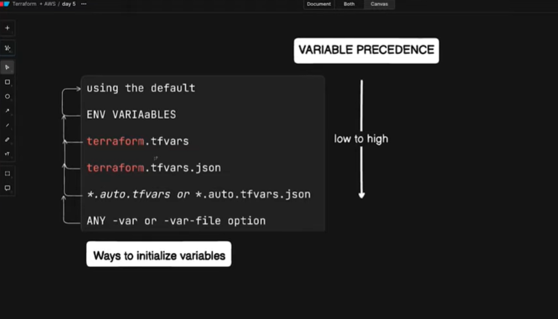

## Variables

- Variables is a way to pass dynamic value to the resource argument or to pass the required arguement to child module.

- All the variables should be declared using below syntax before using it in the resource. Even when calling the child module from parent. Terraform does not create variables automatically from a .tfvars file.

``` hcl
variable "ami"{
    descrition = "Variable description"
    type = string | number | bool | list | map | other
    deafult = "default value"
}

Usage:

resource aws_instance example{
    ami = var.ami
}
```

## Sensitive Flag

- The sensitive flag prevents Terraform from displaying the value in CLI output and logs. The value is still stored in the Terraform state file.
- If you don't want Terraform to store the value in the state file, use an ephemeral variable (Terraform 1.10+).
``` hcl
Sensitive:

variable "db_password" {
  type      = string
  sensitive = true
}

Terraform behaves like this:

CLI Output        State File

Password Hidden   Password Stored
       ✓                 ✓
________________________________________

Ephemeral:

variable "db_password" {
  type      = string
  sensitive = true
  ephemeral = true
}

Now Terraform behaves like this:

CLI Output        State File

Password Hidden   Password NOT Stored
       ✓                 ✗
```
- If a variable is flagged as sensitive in a child module, the calling parent module does not have to declare it as sensitive. If the parent exposes that value again as an output, that output must also be marked sensitive = true.

## Passing values to variable

During tf plan if terraform finds varaible values are passed dynamically from more than one source. Terraform follows below precedence.



1) Any -var and -var-file options on the command line in the order provided and variables from HCP Terraform
``` hcl
 terraform plan -var="instance_type=t3.mciro"
            (or)
  terraform plan -var-file="dev.tfvars"
```
2) Any *.auto.tfvars or *.auto.tfvars.json files in lexical order. This gives us the flexibility to use custom name for our tfvars file and get auto applied no need to pass with tf plan or apply cmds using -var-file.
- They are loaded in lexical (alphabetical) order.
- If the same variable exists in multiple files, the value from the later file overrides the earlier one.
3) terraform.tfvars.json file or terraform.tfvars file
4) Environment variables using export in the shell before running
``` hcl
if your Terraform variable is: variable "instance_type" {}
Then the environment variable must be: **TF_VAR_**instance_type

export TF_VAR_instance_type="t3.micro"
terraform plan
```
5) The default argument of the variable block

| Filename                   | Auto Loaded? |
| -------------------------- | ------------ |
| `terraform.tfvars`         | ✅ Yes        |
| `terraform.tfvars.json`    | ✅ Yes        |
| `common.auto.tfvars`       | ✅ Yes        |
| `dev.auto.tfvars`          | ✅ Yes        |
| `network.auto.tfvars.json` | ✅ Yes        |
| `dev.tfvars`               | ❌ No         |
| `prod.tfvars`              | ❌ No         |
| `stage.tfvars.json`        | ❌ No         |

## Const Variable

Terraform evaluates input variables during the planning phase. However, some Terraform configuration, such as module source, provider source, and provider version, must be known during terraform init because Terraform needs this information before planning.

Syntax:

variable "module_version" {
  type  = string
  const = true
}

Example
variable "module_version" {
  type  = string
  const = true
}

module "network" {
  source = "git::https://github.com/company/network.git?ref=${var.module_version}"
}